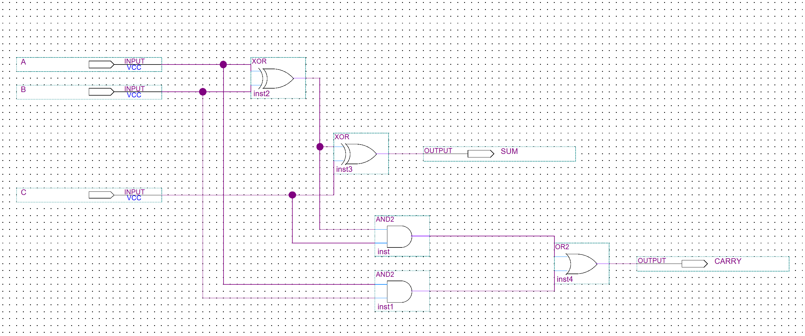
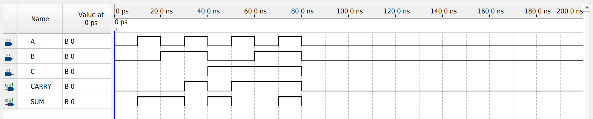

# 1-Bit Full Adder

A 1-bit full adder designed in Intel/Altera Quartus Prime using schematic-based digital logic. The circuit accepts three 1-bit inputs and produces a sum and carry output.

## Overview

A full adder performs binary addition on three inputs:

- `A` - first input bit
- `B` - second input bit
- `C` - carry-in
- `SUM` - resulting sum bit
- `CARRY` - carry-out bit

The circuit was implemented using logic gates in the Quartus Block Diagram/Schematic Editor.

## Hardware and Software

- Intel/Altera Quartus Prime Lite
- Originally developed in Quartus Prime Lite 18.1
- Revalidated in Quartus Prime Lite 25.1
- Intel MAX 10 FPGA
- Target device: `10M50DAF484C7G`
- DE10-Lite development platform
- Quartus Simulation Waveform Editor

## Circuit Schematic

## Truth Table

| A | B | C | SUM | CARRY |
|---|---|---|-----|-------|
| 0 | 0 | 0 |  0  |   0   |
| 0 | 0 | 1 |  1  |   0   |
| 0 | 1 | 0 |  1  |   0   |
| 0 | 1 | 1 |  0  |   1   |
| 1 | 0 | 0 |  1  |   0   |
| 1 | 0 | 1 |  0  |   1   |
| 1 | 1 | 0 |  0  |   1   |
| 1 | 1 | 1 |  1  |   1   |

## Functional Verification

The circuit was verified using the Quartus Simulation Waveform Editor.

The waveform test exercises all eight possible combinations of the three binary inputs. The simulated `SUM` and `CARRY` outputs matched the expected full-adder truth table for every input combination.

## Results

- Full compilation completed successfully with 0 errors.
- All eight possible input combinations were tested.
- `SUM` matched the expected value for all test cases.
- `CARRY` matched the expected value for all test cases.

## Repository Files

- `Fulladder1bitNO.bdf` - Quartus block diagram containing the full-adder circuit
- `Fulladder1bitNO.qpf` - Quartus project file
- `Fulladder1bitNO.qsf` - Quartus project settings and assignments
- `Waveform.vwf` - functional simulation input waveform
- `images/` - schematic and simulation screenshots

## Reproducing the Project

1. Open `Fulladder1bitNO.qpf` in Quartus Prime Lite.
2. Run **Processing → Start Compilation**.
3. Open `Waveform.vwf` in the Simulation Waveform Editor.
4. Run the functional simulation.
5. Compare the `SUM` and `CARRY` outputs with the truth table above.

### Quartus 25.1 Simulation Note

When running the legacy VWF simulation in Quartus Prime Lite 25.1, the simulator required:

`-voptargs="+acc"`

in the functional simulation `vsim` command so that the waveform signals remained accessible during simulation.

## Coursework Attribution

This project originated as a lab assignment and has been independently reorganized, recompiled, simulated, and documented.