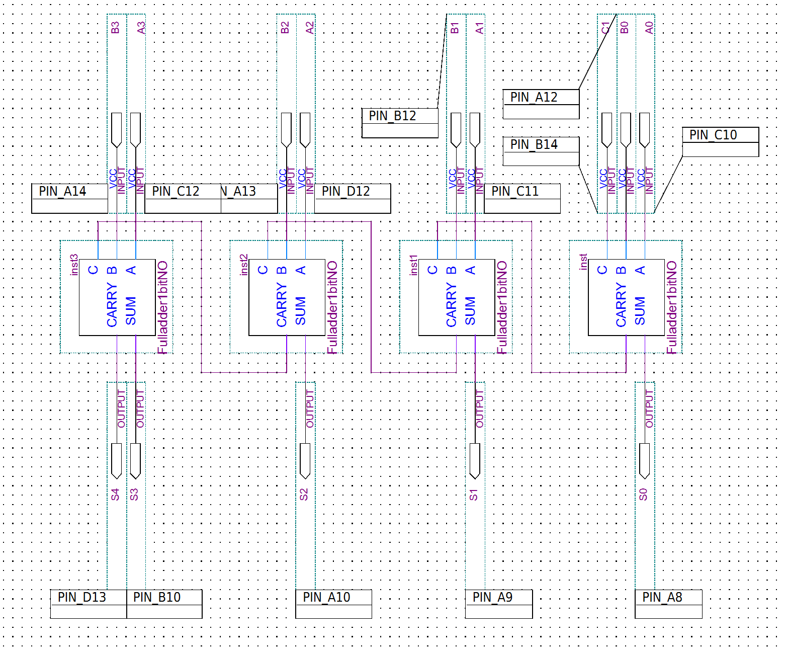
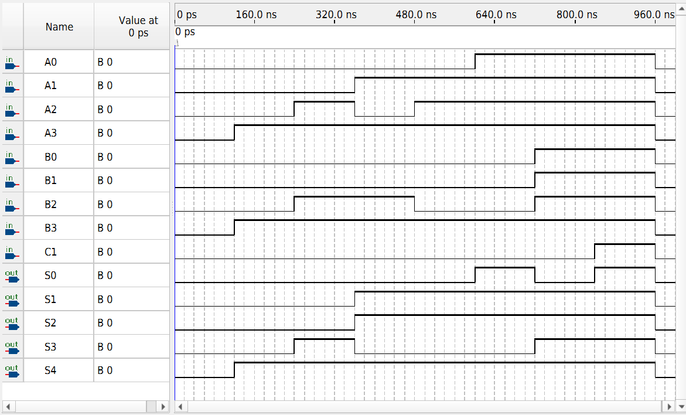

# 4-Bit Ripple-Carry Full Adder

This project implements a 4-bit ripple-carry adder in Intel Quartus Prime using four reusable 1-bit full-adder blocks.

The design accepts two 4-bit binary inputs and a carry-in bit, then produces a 4-bit sum and a final carry-out.

## Design

The 4-bit adder is constructed by cascading four 1-bit full adders.

Each stage:
- Adds one bit from input A
- Adds one bit from input B
- Accepts a carry-in from the previous stage
- Produces one sum bit
- Passes a carry-out to the next stage

The carry propagates from the least-significant bit through the most-significant bit, forming a ripple-carry architecture.

### Inputs

- `A0`–`A3` — 4-bit input A
- `B0`–`B3` — 4-bit input B
- `C1` — external carry-in

### Outputs

- `S0`–`S3` — 4-bit sum
- `S4` — final carry-out

## Schematic

The top-level design instantiates four `Fulladder1bitNO` blocks and connects the carry output of each stage to the carry input of the next stage.

## Functional Verification

The design was functionally simulated using the Quartus Simulation Waveform Editor.

Representative test cases were used to verify:
- Basic addition
- Carry propagation between stages
- Maximum 4-bit input values
- External carry-in behavior

For example:

| A | B | Carry In | Result |
|---|---|---:|---|
| `1111` | `1111` | `0` | `11110` |
| `1111` | `1111` | `1` | `11111` |

These correspond to:

- 15 + 15 = 30
- 15 + 15 + 1 = 31

## Compilation

The project was originally created in Quartus Prime Lite and later revalidated using Quartus Prime Lite 25.1.

Full compilation completed successfully with:

- 0 compilation errors
- Intel MAX 10 target device
- Device: `10M50DAF484C7G`

The project does not include timing constraints, so no timing-verification claims are made.

## Tools

- Intel Quartus Prime Lite
- Block Diagram/Schematic File (`.bdf`)
- Simulation Waveform File (`.vwf`)
- Intel MAX 10 FPGA

## Project Files

- `Fulladder4bitNO.bdf`
- `Fulladder4bitNO.qpf`
- `Fulladder4bitNO.qsf`
- `Waveform.vwf`
- `images/`

## Notes

The 4-bit design reuses the 1-bit full-adder implementation located in the adjacent `1-bit-full-adder` project folder.

This project was completed as part of digital logic coursework and has been reorganized and revalidated for archival and portfolio use.